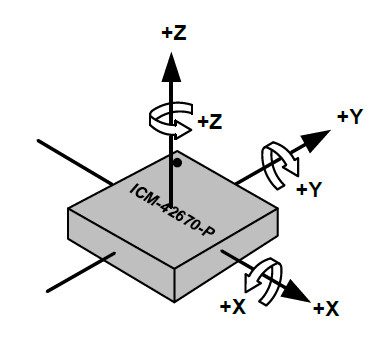
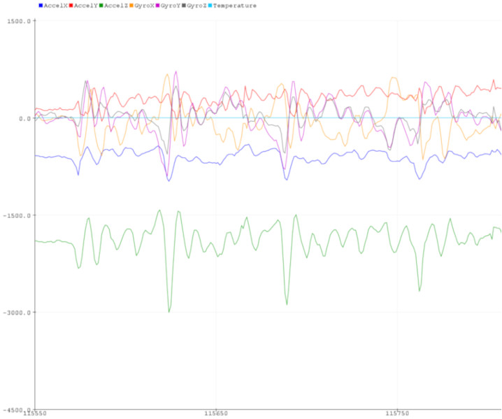

# ICM42670P Arduino library
This arduino library is for the [TDK/Invensense ICM42670P High Performance 6-Axis MotionTracking<sup>(TM)</sup> IMU](https://invensense.tdk.com/products/motion-tracking/6-axis/icm-42670-p).
The ICM42670P is a high performance 6-axis MEMS MotionTracking device that combines a 3-axis gyroscope and a 3-axis accelerometer. It has a configurable host interface that supports I3C<sup>SM</sup>, I2C, and SPI serial communication, features up to 2.25 Kbytes FIFO and 2 programmable interrupts with ultra-low-power wake-on-motion support to minimize system power consumption.
This library supports both I2C and SPI commmunication with the ICM42670P.

# Software setup
Use Arduino Library manager to find and install the ICM42670P library.

# Hardware setup

## Arduino Zero connection with  ICM42670P Daughter board

There is currently no Arduino shield for the ICM42670P.
The wiring must be done manually between the Arduino motherboard and the ICM42670P eval board.
The below wiring description is given for an Arduino Zero board, it depends on the interface to be used:

* I2C

|Arduino Zero|ICM42670P daughter board|
| --- | --- |
| 3V3        | CN4.9 & CN5.10 |
| GND        | CN5.9          |
| SDA        | CN5.4          |
| SCL        | CN5.6          |

* SPI

|Arduino Zero|ICM42670P daughter board|
| --- | --- |
| 3V3        | CN4.9 & CN5.10 |
| GND        | CN5.9          |
| MISO=SPI.1 | CN4.7          |
| MOSI=SPI.4 | CN5.4          |
| SCK=SPI.3  | CN5.6          |
| CS=DIG.8   | CN5.8          |

Note: SPI Chip Select can be mapped on any free digital IO, updating the sketches accordingly

* Interrupt

|Arduino Zero|ICM42670P daughter board|
| --- | --- |
| DIG.2        | CN4.1        |

Note: Interrupt pin can be mapped on any free interruptable IO, updating the sketches accordingly

## Arduino Zero connection with  ICM42670P Eval board

* I2C

|Arduino Zero|ICM42670P eval board|
| --- | --- |
| 5V         | CN1.19         |
| GND        | CN1.11         |
| SDA        | CN1.18         |
| SCL        | CN1.16         |

* SPI

|Arduino Zero|ICM42670P eval board|
| --- | --- |
| 5V         | CN1.19         |
| GND        | CN1.11         |
| MISO=SPI.1 | CN1.18         |
| MOSI=SPI.4 | CN1.20         |
| SCK=SPI.3  | CN1.16         |
| CS=DIG.8   | CN1.4          |

Note: SPI Chip Select can be mapped on any free digital IO, updating the sketches accordingly

* Interrupt

|Arduino Zero|ICM42670P eval board|
| --- | --- |
| DIG.2        | CN1.3        |

Note: Interrupt pin can be mapped on any free interruptable IO, updating the sketches accordingly


## Orientation of axes

The diagram below shows the orientation of the axes of sensitivity and the polarity of rotation. Note the pin 1 identifier (•) in the
figure.



# Library API

## Create ICM42670P instance

**ICM42670P(TwoWire &i2c,bool lsb)**

Create an instance of the ICM42670P that will be accessed using the specified I2C. The LSB of the I2C address can be set to 0 or 1.  
I2C default clock is 400kHz.

```C++
ICM42670P IMU(Wire,0);
```

**ICM42670P(TwoWire &i2c,bool lsb, uint32_t freq)**

Same as above, specifying the I2C clock frequency (must be between 100kHz and 1MHz)

```C++
ICM42670P IMU(Wire,0,1000000);
```

**ICM42670P(SPIClass &spi,uint8_t cs_id)**

Create an instance of the ICM42670P that will be accessed using the specified SPI. The IO number to be used as chip select must be specified.  
SPI default clock is 6MHz.

```C++
ICM42670P IMU(SPI,8);
```

**ICM42670P(SPIClass &spi,uint8_t cs_id, uint32_t freq)**

Same as above, specifying the SPI clock frequency (must be between 100kHz and 24MHz)

```C++
ICM42670P IMU(SPI,8,12000000);
```

## Initialize the ICM42670P
Call the begin method to execute the ICM42670P initialization routine. 

**int begin()**

Initializes all the required parameters in order to communicate and use the ICM42670P.

```C++
IMU.begin();
```

## Log sensor data

**int startAccel(uint16_t odr, uint16_t fsr)**

This method starts logging with the accelerometer, using the specified full scale range and output data rate.
Supported ODR are: 12, 25, 50, 100, 200, 400, 800, 1600 Hz (any other value defaults to 100 Hz). 
Supported full scale ranges are: 2, 4, 8, 16 G (any other value defaults to 16 G).

```C++
IMU.startAccel(100,16);
```

**int startGyro(uint16_t odr, uint16_t fsr)**

This method starts logging with the gyroscope, using the specified full scale range and output data rate.
Supported ODR are: 12, 25, 50, 100, 200, 400, 800, 1600 Hz (any other value defaults to 100 Hz). 
Supported full scale ranges are: 250, 500, 1000, 2000 dps (any other value defaults to 2000 dps).

```C++
IMU.startGyro(100,2000);
```

**int getDataFromRegisters(inv_imu_sensor_event_t\& evt)**

This method reads the ICM42670P sensor data from registers and fill the provided event structure with sensor raw data.
Raw data can be translated to International System using the configured FSR for each sensor. Temperature in Degrees Centigrade = (TEMP_DATA / 128) + 25

```C++
inv_imu_sensor_event_t imu_event;
IMU.getDataFromRegisters(imu_event);
Serial.print("AccelX:");
Serial.println(imu_event.accel[0]);
Serial.print("AccelY:");
Serial.println(imu_event.accel[1]);
Serial.print("AccelZ:");
Serial.println(imu_event.accel[2]);
Serial.print("GyroX:");
Serial.println(imu_event.gyro[0]);
Serial.print("GyroY:");
Serial.println(imu_event.gyro[1]);
Serial.print("GyroZ:");
Serial.println(imu_event.gyro[2]);
Serial.print("Temperature:");
Serial.println(imu_event.temperature);
```

**int enableFifoInterrupt(uint8_t intpin, ICM42670P_irq_handler handler, uint8_t fifo_watermark)**

This method initializes the fifo and the interrupt of the ICM42670P. The interrupt is triggered each time there is enough samples in the fifo (as specified by fifo_watermark), and the provided handler is called.
Any interuptable pin of the Arduino can be used for intpin.

```C++
uint8_t irq_received = 0;

void irq_handler(void)
{
  irq_received = 1;
}
...

// Enable interrupt on pin 2
IMU.enableFifoInterrupt(2,irq_handler);
```

**int getDataFromFifo(ICM42670P_sensor_event_cb event_cb)**

This method reads the ICM42670P sensor data samples stored in the FIFO and call the provided event handler with the sample event as parameter.
Raw data can be translated to International System using the configured FSR for each sensor. Temperature in Degrees Centigrade = (TEMP_DATA / 2) + 25

```C++
void event_cb(inv_imu_sensor_event_t&ast; evt)
{
  Serial.print("AccelX:");
  Serial.println(evt->accel[0]);
  Serial.print("AccelY:");
  Serial.println(evt->accel[1]);
  Serial.print("AccelZ:");
  Serial.println(evt->accel[2]);
  Serial.print("GyroX:");
  Serial.println(evt->gyro[0]);
  Serial.print("GyroY:");
  Serial.println(evt->gyro[1]);
  Serial.print("GyroZ:");
  Serial.println(evt->gyro[2]);
  Serial.print("Temperature:");
  Serial.println(evt->temperature);
}

void loop() {
  // Wait for interrupt to read data from fifo
  if(irq_received)
  {
      irq_received = 0;
      IMU.getDataFromFifo(event_cb);
  }
}
```

**bool isAccelDataValid(inv_imu_sensor_event_t&ast; evt)**

This method checks if the accelerometer data in the FIFO sample is valid.

```C++
void event_cb(inv_imu_sensor_event_t&ast; evt)
{
  if(IMU.isAccelDataValid(evt)) {
    ...
  }
}

```

**bool isGyroDataValid(inv_imu_sensor_event_t&ast; evt)**

This method checks if the gyroscope data in the FIFO sample is valid.

```C++
void event_cb(inv_imu_sensor_event_t&ast; evt)
{
  if(IMU.isGyroDataValid(evt)) {
    ...
  }
}

```

**inv_imu_sensor_event_t**

This structure is used by the ICM42670P driver to return raw sensor data. Available data is:
|Field name|description|
| --- | --- |
| sensor_mask       | Mask describing available data         |
| timestamp_fsync   | Timestamp in 16us resolution           |
| accel[3]          | 3-axis accel raw data                  |
| gyro[3]           | 3-axis gyro raw data                   |
| temperature       | Temperature raw data (on 1 or 2 bytes) |
| accel_high_res[3] | 3- axis accel lsb in high resolution   |
| gyro_high_res[3]  | 3- axis gyro LSB in high resolution    |

## APEX functions

**int startTiltDetection(uint8_t intpin, ICM42670P_irq_handler handler)**

This method starts the tilt detection algorithm.
The provided *handler* is called when a tilt event is detected.
Any interuptable pin of the Arduino can be used for *intpin*.
Parameters are optionals: if *handler* and *intpin* are omitted, no handler will be registered.

```C++
void irq_handler(void) {
  Serial.println("TILT");
}

// Accel ODR = 50 Hz and APEX Tilt enabled
IMU.startTiltDetection(2,irq_handler);

```

**bool getTilt(void)**

This method gets the Tilt detection algorithm status.
It returns true if a Tilt was detected since last call to this function.

```C++
if(IMU.getTilt())
{
  Serial.println("Tilt");
}
```

**int startPedometer(uint8_t intpin, ICM42670P_irq_handler handler)**

This method starts the pedometer algorithm.
The provided *handler* is called when a pedometer event is detected.
Any interuptable pin of the Arduino can be used for *intpin*.
Parameters are optionals: if *handler* and *intpin* are omitted, no handler will be registered.

```C++
volatile uint8_t irq_received = 0;

void irq_handler(void) {
  irq_received = 1;
}

// Accel ODR = 50 Hz and APEX Pedometer enabled
IMU.startPedometer(2,irq_handler);
```

**int getPedometer(uint16_t\& step_count, float\& step_cadence, const char&ast;\& activity)**

This method gets the pedometer algorithm output.
The pedometer algorithm returns the number of steps as *step count*, the number of steps per seconds as the *step cadence* and the walk/run *activity*.

```C++
uint16_t step_count=0;
float step_cadence=0;
const char* activity;
IMU.getPedometer(step_count,step_cadence,activity);
Serial.print("Step count:");
Serial.println(step_count);
Serial.print("Step cadence:");
Serial.println(step_cadence);
Serial.print("activity:");
Serial.println(activity);
```

**int startWakeOnMotion(uint8_t intpin, ICM42670P_irq_handler handler)**

This method starts the Wake on Motion algorithm.
The provided *handler* is called when a movement is detected.
Any interuptable pin of the Arduino can be used for *intpin*.

```C++
volatile bool wake_up = false;

void irq_handler(void) {
  wake_up = true;
}

// APEX WoM enabled, irq on pin 2
IMU.startWakeOnMotion(2,irq_handler);
```

**int enableInterrupt(uint8_t intpin, ICM42670P_irq_handler handler)**

This method registers an interrupt for the IMU.
The provided *handler* is called when an interrupt occurs.
Any interuptable pin of the Arduino can be used for *intpin*.

```C++
// Pedometer enabled
IMU.startPedometer();
// Tilt enabled
IMU.startTiltDetection();
// Enable interrupt
IMU.enableInterrupt(2, irq_handler);
```

# Available Sketches

**Polling_I2C**

This sketch initializes the ICM42670P with the I2C interface, and starts logging raw sensor data from IMU registers. Sensor data can be monitored on Serial monitor or Serial plotter

**Polling_SPI**

This sketch initializes the ICM42670P with the SPI interface, and starts logging raw sensor data from IMU registers. Sensor data can be monitored on Serial monitor or Serial plotter

**FIFO_Interrupt**

This sketch initializes the ICM42670P with the I2C interface and interrupt PIN2, and starts logging raw sensor data from IMU FIFO. Sensor data can be monitored on Serial monitor or Serial plotter

**APEX_Tilt**

This sketch initializes the ICM42670P with the I2C interface and interrupt PIN2, and starts the APEX Tilt detection. A TILT message is displayed on the Serial monitor when the sensor is tilted for 5 seconds.

**APEX_Pedometer**

This sketch initializes the ICM42670P with the I2C interface and interrupt PIN2, and starts the APEX Pedometer. A Pedometer status is displayed on the Serial monitor (for each step after the 5th step).

**APEX_PedometerAndTilt**

This sketch initializes the ICM42670P with the I2C interface and interrupt PIN2, and starts the APEX Pedometer and Tilt. Pedometer and Tilt status are displayed on the Serial monitor.

**APEX_WakeOnMotion**

This sketch initializes the ICM42670P with the I2C interface and interrupt PIN2, and starts the APEX Wake on Motion. A Wake-up message is displayed on the Serial monitor when the sensor detects movement.

# IMU data monitoring

When the ICM42670P IMU is logging, the Accelerometer, Gyroscope and Temperature raw data can be monitored with the Arduino Serial Plotter (Tools->Serial Plotter).



# Using a different device interface

When switching from a Sketch using the I2C to another using the SPI (or the opposite), it is required to power off the device.

# Increasing Sensor ODR

Sensor output datarate can be increased by changing first argument of startAccel and startGyro in the sketches.
It is also required to increase Serial baudrate (using same parameter for Serial monitor) and/or to reduce the number of printed messages.
When using the I2C interface (@400kHz) and the Serial @2Mbauds, maximum Sensor ODR is 800Hz keeping same amount of messages.

```C++
// Serial at 2Mbauds
Serial.begin(2000000);
// IMU at 800Hz
IMU.startAccel(800,16);
IMU.startGyro(800,16);
```
# Additionnal Sketches

**MicroROS_Publisher**

This sketch initializes the ICM42670P with the I2C interface and interrupt PIN2, initializes also microROS Arduino environment and starts logging raw sensor data from IMU FIFO. Sensor data are published in IMU structure. For more information, refer to MicroROS_README.md.
